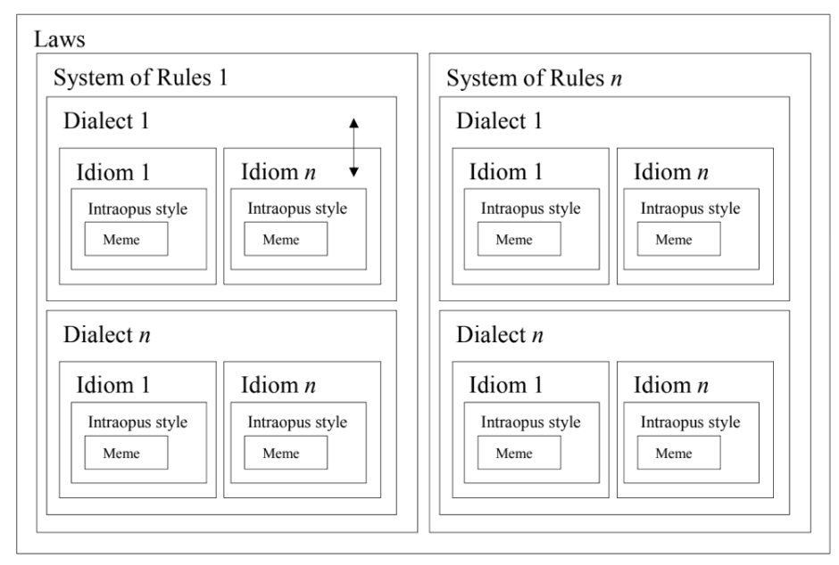

Introduction
============

        on `Unsplash <https://unsplash.com/s/photos/pattern?utm_source=unsplash&amp;utm_medium=referral&amp;utm_content=creditCopyText>`_.

What are Musical Corpus Studies?
--------------------------------

tbc... (text from diss?)

   Hierarchy of musical style analyis after :cite:`Meyer1989`, from :cite:`Jan2007`.

Epistemological goals
---------------------

tbc... 

Issues
------

tbc :cite:`Cook2006,Honing2006,Huron2013,Neuwirth2016,Pugin2005,Schaffer2016,Temperley2013,Volk2011`  

MCS and traditional musicology 
------------------------------

tbc...